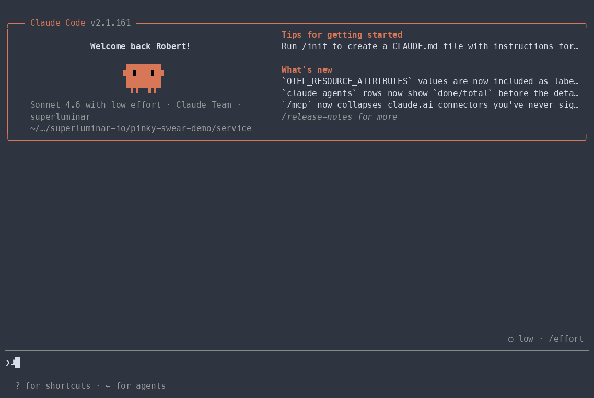

# pinky-promise

API contract enforcement for Claude Code. Keeps producer and consumer services in sync by hooking into every stage of the [superpowers](https://github.com/obra/superpowers) development workflow — brainstorming, planning, implementation, review, and branch completion.

When you build a service that other services call, you make a promise about its interface. pinky-promise makes that promise explicit, versioned, and enforced:

- **Producers** define their public API surface during brainstorming and publish it to a shared registry when the branch is complete.
- **Consumers** pin to a specific version and get their implementation validated against the published spec at every code review.
- **Breaking changes** are caught before they're planned, not after they're deployed.

pinky-promise is also flexible about where specs come from. Use `/api-spec-import` to register any external API — Stripe, Twilio, an internal platform service — directly from its OpenAPI, gRPC, or GraphQL spec. Once imported, consumer code calling that API gets the same contract validation as internally-owned services.

Everything lives in a git registry you control. No external services required.

## See it in action

**Catching a breaking change before it's planned:**


## Requirements

- Claude Code with the [superpowers](https://github.com/obra/superpowers) plugin installed
- A git repository to use as the API registry (see [Registry setup](#registry-setup))
- SSH access to the registry from the machines running Claude Code

## Installation

pinky-promise is not listed in the official Anthropic marketplace. Install it via the superluminar-io marketplace.

**First, install superpowers if you haven't already:**

```
/plugin install superpowers@claude-plugins-official
```

**Add the pinky-promise marketplace** (once per machine):

```bash
claude plugin marketplace add https://github.com/superluminar-io/pinky-promise
```

**Then install** (run from your project directory):

```bash
claude plugin install pinky-promise@superluminar-io --scope project
```

To update after new releases:

```bash
claude plugin marketplace update superluminar-io
claude plugin update pinky-promise@superluminar-io --scope project
```

**From a local checkout** (for development or contributing):

```bash
git clone git@github.com:superluminar-io/pinky-promise.git
./pinky-promise/install-local.sh /path/to/your/project
```

To sync changes after editing the plugin source:

```bash
./pinky-promise/install-local.sh /path/to/your/project --update
```

## Getting started

### First: set up the registry

The registry is a plain git repository shared across all your services. Create it once per organisation.

```bash
mkdir api-registry && cd api-registry
git init
mkdir -p services && touch services/.gitkeep
git add services/ && git commit -m "chore: init registry"
git remote add origin git@github.com:yourorg/api-registry.git
git push -u origin main
```

### As a service producer

**1. Install pinky-promise** in your service repo (see [Installation](#installation))

**2. Configure the registry URL** in `.claude/settings.json`:

```json
{
  "env": {
    "API_REGISTRY_REPO": "git@github.com:yourorg/api-registry.git"
  }
}
```

**3. Start a brainstorm** — open a Claude Code session and describe what you're building. pinky-promise interleaves API surface questions with the design discussion and writes the draft to `.pinky-promise/`.

**4. Finish the branch** — pinky-promise publishes the spec to the registry automatically when the branch is completed.

### As a service consumer

You only need access to the registry — not to the producer's codebase.

**1. Install pinky-promise** in your consumer repo (see [Installation](#installation))

**2. Configure the same registry URL** in `.claude/settings.json`:

```json
{
  "env": {
    "API_REGISTRY_REPO": "git@github.com:yourorg/api-registry.git"
  }
}
```

**3. Start implementing** — when your code calls another service, pinky-promise prompts you to declare the dependency in `api-dependencies.json` and validates every call against the published spec at planning, implementation, and code review.

### Consuming an external API

If you're calling a third-party API (Stripe, Twilio, etc.) run `/api-spec-import` with its spec URL:

```
/api-spec-import https://raw.githubusercontent.com/stripe/openapi/master/openapi/spec3.json
```

pinky-promise converts and imports it into the registry. From that point, your calls to that API are validated the same way as internally-owned services.

## How it works

Once installed, pinky-promise injects checks at six points in the superpowers workflow:

| Stage | What happens |
|---|---|
| **Session start** | Fetches the current service's published spec into context |
| **Brainstorming** | Defines the API surface (new service) or flags breaking changes (existing service) |
| **Writing plans** | Validates calls to other services before the plan is finalised |
| **Subagent development** | Blocks implementation tasks that would change a published interface |
| **Code review** | Checks consumer code against pinned specs; flags interface changes in producer code |
| **Branch completion** | Publishes the draft spec to the registry |

If `API_REGISTRY_REPO` is not set, all checks skip silently — pinky-promise never blocks work on unconfigured projects.

## Skills

| Skill | Trigger | What it does |
|---|---|---|
| `api-spec-brainstorming` | New service with no published spec | Elicits operations, types, events, subscriptions, and bindings; writes draft to `.pinky-promise/` |
| `api-change-guardian` | Proposed change to a published interface | Classifies the change (major/minor/patch), records the decision, blocks unresolved deferrals at publish time |
| `api-contract-check` | Consumer code or plan calls another service | Validates calls against the pinned spec; warns about missing credentials, deprecated usage, and available updates |
| `api-spec-publish` | Branch completion with a draft spec present | Resolves guardian decisions, bumps the version, pushes contract and bindings to the registry |
| `/api-spec-import` | Registering an external API (OpenAPI, gRPC, GraphQL) | Converts and imports an external spec into the registry so contract-check can validate calls against it |

## The spec format

Each service has two files in the registry:

```
services/
  user-service/
    1.0.0.json      ← abstract contract (versioned)
    bindings.json   ← protocol mappings + auth (not versioned)
```

**Contract file** — operations, events, subscriptions, types. No transport details.

```json
{
  "pinkyPromiseVersion": 1,
  "name": "user-service",
  "version": "1.0.0",
  "operations": [
    {
      "name": "getUser",
      "kind": "operation",
      "description": "Fetch a user by ID. Use when you have a userId and need their profile.",
      "input": { "userId": { "type": "string" } },
      "output": { "type": "User" }
    }
  ],
  "types": {
    "User": {
      "kind": "object",
      "fields": {
        "id": { "type": "string" },
        "name": { "type": "string" },
        "email": { "type": "string" }
      }
    }
  }
}
```

**Bindings file** — how to reach the service, including auth flow and per-version endpoints.

```json
{
  "pinkyPromiseVersion": 1,
  "service": "user-service",
  "bindings": [
    {
      "contractVersion": "1.*",
      "protocol": "http-json-rest",
      "prefix": "/v1",
      "operations": {
        "getUser": { "method": "GET", "path": "/users/{userId}" }
      },
      "connection": {
        "url": "https://api.example.com",
        "auth": {
          "type": "oauth2",
          "flow": "client_credentials",
          "tokenUrl": "https://auth.example.com/token",
          "scopes": ["api:read"]
        }
      }
    }
  ]
}
```

The `description` field on operations, events, and subscriptions is used as the MCP tool description when the service is exposed via an MCP server — write it from the caller's perspective.

See [`docs/idl-reference.md`](docs/idl-reference.md) for the full schema including auth types, `contractVersion` matching, and the consumer-side `credentials.json` format.

## Configuration

### Registry URL

Set `API_REGISTRY_REPO` in `.claude/settings.json` (committed, shared with the team) or `.claude/settings.local.json` (gitignored, machine-local):

```json
{
  "env": {
    "API_REGISTRY_REPO": "git@github.com:yourorg/api-registry.git"
  }
}
```

If `API_REGISTRY_REPO` is not set, all skills skip silently. If it is set but unreachable, Claude warns once at session start that contract checks are disabled for the session.

### Consumer projects

Declare which service versions you depend on in `api-dependencies.json` at the project root:

```json
{
  "user-service": "1.0.0",
  "payment-service": "2.1.0"
}
```

`api-contract-check` creates this file interactively on first run.

### Credentials

If a service requires authentication, add a `.pinky-promise/credentials.json` (gitignored) with your credential values:

```json
{
  "user-service": {
    "client_id": "${MY_CLIENT_ID}",
    "client_secret": "${MY_CLIENT_SECRET}"
  }
}
```

The producer's `bindings.json` declares the auth flow (type, token endpoint, scopes). Your `credentials.json` maps your own env vars to the standard protocol parameters — the producer has no say in your variable naming.

## Versioning

pinky-promise follows semantic versioning:

| Bump | What changes |
|---|---|
| **patch** | Bug fixes, skill clarifications — no format changes |
| **minor** | Additive: new optional fields, new skills, new auth types |
| **major** | Breaking: IDL format, bindings schema, or skill behaviour |

Registry files carry a `pinkyPromiseVersion` field. If a skill encounters a file written by a newer format version than it supports, it warns and stops rather than silently misparsing.

### Pinning to a release

By default `marketplace add` tracks `main`. To pin to a specific release:

```bash
claude plugin marketplace add https://github.com/superluminar-io/pinky-promise@v1.0.0 --scope project
claude plugin install pinky-promise@pinky-promise-local --scope project
```

Check the [releases page](https://github.com/superluminar-io/pinky-promise/releases) for available tags.

## Registry setup

See [`docs/registry-setup.md`](docs/registry-setup.md) for registry layout, commit format, and SSH access configuration.
